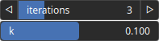

Fold Node
=========

Fold iteratively applies the absolute value function to the input field, effectively folding negative values to their positive counterparts.

## Category

Filter/Recast
## Inputs

|Name|Type|Description|
| :--- | :--- | :--- |
|input|VirtualArray|Input heightmap.|

## Outputs

|Name|Type|Description|
| :--- | :--- | :--- |
|output|VirtualArray|Folded heightmap.|

## Parameters

|Name|Type|Description|
| :--- | :--- | :--- |
|iterations|Integer|Number of successive foldings.|
|k|Float|Smoothing parameter of the smooth absolute value.|

## Example

Corresponding Hesiod file: [Fold.hsd](../../examples/Fold.hsd). Use [Ctrl+I] in the node editor to import a hsd file within your current project.

!!! note
    Example files are kept up-to-date with the latest version of [Hesiod](https://github.com/otto-link/Hesiod).
    If you find an error, please [open an issue](https://github.com/otto-link/Hesiod/issues).

