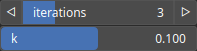

Fold Node
=========

Fold iteratively applies the absolute value function to the input field, effectively folding negative values to their positive counterparts.

# Category

Filter/Recast
# Inputs

|Name|Type|Description|
| :--- | :--- | :--- |
|input|Heightmap|Input heightmap.|

# Outputs

|Name|Type|Description|
| :--- | :--- | :--- |
|output|Heightmap|Folded heightmap.|

# Parameters

|Name|Type|Description|
| :--- | :--- | :--- |
|iterations|Integer|Number of successive foldings.|
|k|Float|Smoothing parameter of the smooth absolute value.|

# Example

