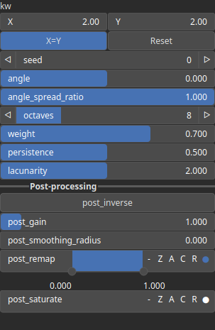

GaborWaveFbm Node
=================

Generates fractal Brownian motion (fBm) noise using Gabor wavelets, producing anisotropic textures with directional control.

# Category

Primitive/Coherent
# Inputs

|Name|Type|Description|
| :--- | :--- | :--- |
|angle|Heightmap|Optional input for dynamically controlling the wavelet orientation per pixel.|
|control|Heightmap|Optional input for modulating noise intensity or distribution.|
|dx|Heightmap|Optional input to control horizontal displacement in the noise generation.|
|dy|Heightmap|Optional input to control vertical displacement in the noise generation.|
|envelope|Heightmap|Modulates the noise amplitude across the heightmap.|

# Outputs

|Name|Type|Description|
| :--- | :--- | :--- |
|output|Heightmap|The generated Gabor wavelet-based fractal noise heightmap.|

# Parameters

|Name|Type|Description|
| :--- | :--- | :--- |
|angle|Float|Controls the base orientation of the Gabor wavelets, influencing the dominant direction of the noise pattern.|
|angle_spread_ratio|Float|Determines how much the local angle of the Gabor kernel can vary. A low value results in straighter structures, while a high value introduces more directional variation.|
|kw|Wavenumber|Defines the wavenumber, which controls the frequency of the Gabor wavelets in the noise function.|
|lacunarity|Float|Controls the frequency scaling between successive octaves of the fractal noise. Higher values create larger gaps between frequencies.|
|octaves|Integer|Specifies the number of noise layers (octaves) used in the fractal Brownian motion. More octaves add finer details.|
|persistence|Float|Controls how much each successive octave contributes to the final noise pattern. Higher values result in more prominent fine details.|
|Gain|Float|Set the gain. Gain is a power law transformation altering the distribution of signal values, compressing or expanding certain regions of the signal depending on the exponent of the power law.|
|Invert Output|Bool|Inverts the output values after processing, flipping low and high values across the midrange.|
|Remap Range|Value range|Linearly remaps the output values to a specified target range (default is [0, 1]).|
|Saturation Range|Value range|Modifies the amplitude of elevations by first clamping them to a given interval and then scaling them so that the restricted interval matches the original input range. This enhances contrast in elevation variations while maintaining overall structure.|
|Smoothing Radius|Float|Defines the radius for post-processing smoothing, determining the size of the neighborhood used to average local values and reduce high-frequency detail. A radius of 0 disables smoothing.|
|seed|Random seed number|Sets the random seed for noise generation, ensuring reproducibility.|
|weight|Float|Adjusts the intensity of the noise contribution at each point.|

# Example

No example available.