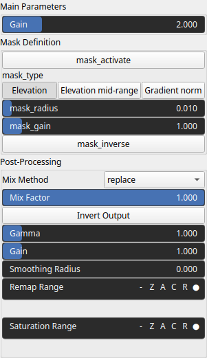

Gain Node
=========

Gain is a power law transformation altering the distribution of signal values, compressing or expanding certain regions of the signal depending on the exponent of the power law.

# Category

Filter/Recurve
# Inputs

|Name|Type|Description|
| :--- | :--- | :--- |
|input|Heightmap|Input heightmap.|
|mask|Heightmap|Mask defining the filtering intensity (expected in [0, 1]).|

# Outputs

|Name|Type|Description|
| :--- | :--- | :--- |
|output|Heightmap|Filtered heightmap.|

# Parameters

|Name|Type|Description|
| :--- | :--- | :--- |
|gain|Float|Power law exponent.|

# Example

No example available.