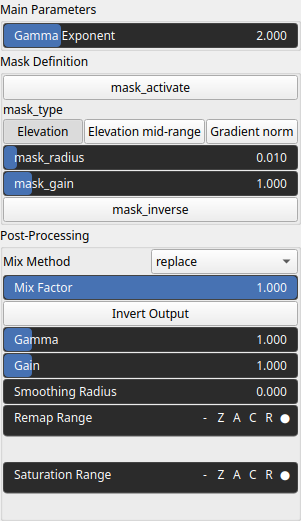

GammaCorrection Node
====================

Gamma correction involves applying a nonlinear transformation to the pixel values of the heightmap. This transformation is based on a power-law function, where each pixel value is raised to the power of the gamma value. The gamma value is a parameter that determines the degree and direction of the correction.

# Category

Filter/Recurve
# Inputs

|Name|Type|Description|
| :--- | :--- | :--- |
|input|Heightmap|Input heightmap.|
|mask|Heightmap|Mask defining the filtering intensity (expected in [0, 1]).|

# Outputs

|Name|Type|Description|
| :--- | :--- | :--- |
|output|Heightmap|Filtered heightmap.|

# Parameters

|Name|Type|Description|
| :--- | :--- | :--- |
|gamma|Float|Gamma exponent.|
|mask_activate|Bool|No description|
|mask_gain|Float|No description|
|mask_inverse|Bool|No description|
|mask_radius|Float|No description|
|mask_type|Choice|No description|
|post_gain|Float|No description|
|post_inverse|Bool|No description|
|post_mix|Float|No description|
|post_mix_method|Enumeration|No description|
|post_remap|Value range|No description|
|post_saturate|Value range|No description|
|post_smoothing_radius|Float|No description|

# Example

No example available.