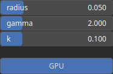

GammaCorrectionLocal Node
=========================

Gamma correction involves applying a nonlinear transformation to the pixel values of the heightmap. For GammaCorrectionLocal, the transformation parameters are locally defined within a perimeter 'radius'.

# Category

Filter/Recurve
# Inputs

|Name|Type|Description|
| :--- | :--- | :--- |
|input|Heightmap|Input heightmap.|
|mask|Heightmap|Mask defining the filtering intensity (expected in [0, 1]).|

# Outputs

|Name|Type|Description|
| :--- | :--- | :--- |
|output|Heightmap|Filtered heightmap.|

# Parameters

|Name|Type|Description|
| :--- | :--- | :--- |
|GPU|Bool|Toogle GPU acceleration on or off.|
|gamma|Float|Gamma exponent.|
|k|Float|Smoothing factor (typically in [0, 1]).|
|radius|Float|Filter radius with respect to the domain size.|

# Example

