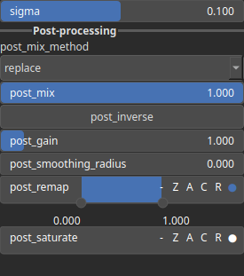

GaussianDecay Node
==================

Apply a Gaussian function to every values.

# Category

Math/Base
# Inputs

|Name|Type|Description|
| :--- | :--- | :--- |
|input|Heightmap|Input heightmap.|

# Outputs

|Name|Type|Description|
| :--- | :--- | :--- |
|output|Heightmap|Output heightmap.|

# Parameters

|Name|Type|Description|
| :--- | :--- | :--- |
|post_gain|Float|Set the gain. Gain is a power law transformation altering the distribution of signal values, compressing or expanding certain regions of the signal depending on the exponent of the power law.|
|post_inverse|Bool|Inverts the output values after processing, flipping low and high values across the midrange.|
|post_mix|Float|Mixing factor for blending input and output values. A value of 0 uses only the input, 1 uses only the output, and intermediate values perform a linear interpolation.|
|post_mix_method|Enumeration|Method used to combine input and output values. Options include linear interpolation (default), min, max, smooth min, smooth max, add, and subtract.|
|post_remap|Value range|Linearly remaps the output values to a specified target range (default is [0, 1]).|
|post_saturate|Value range|No description|
|post_smoothing_radius|Float|Defines the radius for post-processing smoothing, determining the size of the neighborhood used to average local values and reduce high-frequency detail. A radius of 0 disables smoothing.|
|sigma|Float|Gaussian half-width, represents the distance from the peak of the Gaussian curve to the points where the amplitude drops to half of its maximum value.|

# Example

No example available.