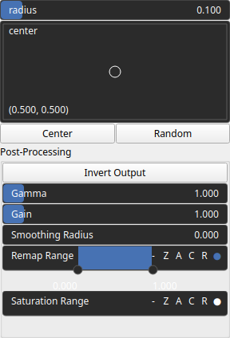

GaussianPulse Node
==================

GaussianPulse generates a Gaussian pulse.

## Category

Primitive/Function
## Inputs

|Name|Type|Description|
| :--- | :--- | :--- |
|control|VirtualArray|Control parameter, acts as a multiplier for the weight parameter.|
|dx|VirtualArray|Displacement with respect to the domain size (x-direction).|
|dy|VirtualArray|Displacement with respect to the domain size (y-direction).|
|envelope|VirtualArray|Heightmap used as a post-process amplitude multiplier for the generated noise.|

## Outputs

|Name|Type|Description|
| :--- | :--- | :--- |
|output|VirtualArray|Gaussian heightmap.|

## Parameters

|Name|Type|Description|
| :--- | :--- | :--- |
|center|Vec2Float|Reference center within the heightmap. Coordinates are in domain units; center.y is measured from the bottom of the map (y increases upward).|
|Gain|Float|Mid-centered gain transformation applied to the elevation values. This is a non-linear recurve operator centered around the mid elevation (typically 0.5). Increasing the gain pushes values toward the minimum and maximum elevations, creating flatter low/high regions with a steeper transition around the midpoint.|
|Gamma|Float|Standard gamma correction applied to the elevation values. This is a monotonic power-law remapping that shifts emphasis toward low or high elevations, making the overall shape sharper or bulkier without changing its ordering.|
|Invert Output|Bool|Inverts the output values after processing, flipping low and high values across the midrange.|
|Remap Range|Value range|Linearly remaps the output values to a specified target range (default is [0, 1]).|
|Saturation Range|Value range|Modifies the amplitude of elevations by first clamping them to a given interval and then scaling them so that the restricted interval matches the original input range. This enhances contrast in elevation variations while maintaining overall structure.|
|Smoothing Radius|Float|Defines the radius for post-processing smoothing, determining the size of the neighborhood used to average local values and reduce high-frequency detail. A radius of 0 disables smoothing.|
|radius|Float|Pulse half-width. Specified in domain units (same scale as center); on a non-square map the footprint is therefore elliptical, since x and y span different physical extents.|

## Example

Corresponding Hesiod file: [GaussianPulse.hsd](../../examples/GaussianPulse.hsd). Use [Ctrl+I] in the node editor to import a hsd file within your current project.

!!! note
    Example files are kept up-to-date with the latest version of [Hesiod](https://github.com/otto-link/Hesiod).
    If you find an error, please [open an issue](https://github.com/otto-link/Hesiod/issues).

