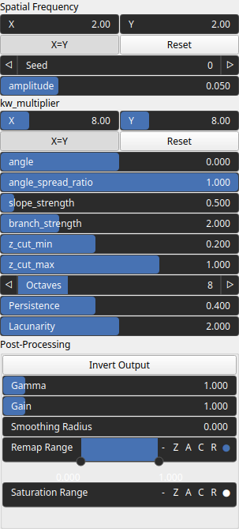

Gavoronoise Node
================

Generates a 2D heightmap using the GavoroNoise algorithm, a procedural noise technique for terrain generation.

# Category

Primitive/Coherent
# Inputs

|Name|Type|Description|
| :--- | :--- | :--- |
|angle|Heightmap|Optional input for dynamically modifying the wavelet orientation per pixel.|
|control|Heightmap|Optional input that modulates noise intensity or distribution.|
|dx|Heightmap|Displacement with respect to the domain size (x-direction).|
|dy|Heightmap|Displacement with respect to the domain size (y-direction).|
|envelope|Heightmap|Heightmap used as a post-process amplitude multiplier for the generated noise.|

# Outputs

|Name|Type|Description|
| :--- | :--- | :--- |
|output|Heightmap|The final heightmap generated using the GavoroNoise algorithm.|

# Parameters

|Name|Type|Description|
| :--- | :--- | :--- |
|amplitude|Float|Controls the overall intensity of the noise function.|
|angle|Float|Sets the primary orientation of the wave structures in the noise.|
|angle_spread_ratio|Float|Determines the degree of variation in the angle of the wave structures. Lower values create more aligned structures.|
|branch_strength|Float|Controls the prominence of branch-like features in the generated noise.|
|inverse|Bool|Invert the output values of the noise function.|
|Spatial Frequency|Wavenumber|Base spatial frequencies in the X and Y directions. The frequencies are defined with respect to the entire domain: for example, kw = 2 produces two full oscillations across the domain width (and similarly for the Y direction).|
|kw_multiplier|Wavenumber|Multiplier applied to the wave numbers, affecting the frequency scaling of the noise function.|
|Lacunarity|Float|The frequency scaling factor for successive noise octaves. Higher values increase the frequency of each successive octave.|
|Octaves|Integer|The number of octaves for fractal noise generation. More octaves add finer details to the terrain.|
|Persistence|Float|The amplitude scaling factor for subsequent noise octaves. Lower values reduce the contribution of higher octaves.|
|remap|Value range|Remap the noise output values to a specified range, defaulting to [0, 1].|
|Seed|Random seed number|Random seed number. The random seed is an offset to the randomized process. A different seed will produce a new result.|
|slope_strength|Float|Controls the strength of slope-based directional erosion in the noise function.|
|z_cut_max|Float|Defines the maximum cutoff value for the Z-axis in the generated noise.|
|z_cut_min|Float|Defines the minimum cutoff value for the Z-axis in the generated noise.|

# Example

No example available.