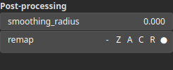

GradientAngle Node
==================

The gradient angle of a heightmap refers to the direction in which the slope points toward. It represents the orientation of the terrain surface relative to a horizontal plane

# Category

Math/Gradient
# Inputs

|Name|Type|Description|
| :--- | :--- | :--- |
|input|Heightmap|Input heightmap.|

# Outputs

|Name|Type|Description|
| :--- | :--- | :--- |
|output|Heightmap|Gradient angle.|

# Parameters

|Name|Type|Description|
| :--- | :--- | :--- |
|remap|Value range|Remap the operator's output to a specified range, defaulting to [0, 1].|

# Example

No example available.