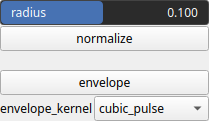

HeightmapToKernel Node
======================

Convert an heightmap to a kernel.

## Category

Converter
## Inputs

|Name|Type|Description|
| :--- | :--- | :--- |
|heightmap|VirtualArray|Input heightmap.|

## Outputs

|Name|Type|Description|
| :--- | :--- | :--- |
|kernel|Array|Output kernel.|

## Parameters

|Name|Type|Description|
| :--- | :--- | :--- |
|envelope|Bool|Determine if an enveloppe is applied to the kernel.|
|envelope_kernel|Enumeration|Envelope kernel. Available values: biweight, cone, cone_smooth, cubic_pulse, disk, lorentzian, smooth_cosine, square, tricube.|
|normalize|Bool|Normalize kernel so that the sum of the elements equals 1, preserving the overall intensity of an heightmap after convolution for instance.|
|radius|Float|Kernel radius with respect to the domain size.|

## Example

Corresponding Hesiod file: [HeightmapToKernel.hsd](../../examples/HeightmapToKernel.hsd). Use [Ctrl+I] in the node editor to import a hsd file within your current project.

!!! note
    Example files are kept up-to-date with the latest version of [Hesiod](https://github.com/otto-link/Hesiod).
    If you find an error, please [open an issue](https://github.com/otto-link/Hesiod/issues).

