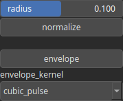

HeightmapToKernel Node
======================

Convert an heightmap to a kernel.

# Category

Converter
# Inputs

|Name|Type|Description|
| :--- | :--- | :--- |
|heightmap|Heightmap|Input heightmap.|

# Outputs

|Name|Type|Description|
| :--- | :--- | :--- |
|kernel|Array|Output kernel.|

# Parameters

|Name|Type|Description|
| :--- | :--- | :--- |
|envelope|Bool|Determine if an enveloppe is applied to the kernel.|
|envelope_kernel|Enumeration|Envelope kernel. Available values: biweight, cone, cone_smooth, cubic_pulse, disk, lorentzian, smooth_cosine, square, tricube.|
|normalize|Bool|Normalize kernel so that the sum of the elements equals 1, preserving the overall intensity of an heightmap after convolution for instance.|
|radius|Float|Kernel radius with respect to the domain size.|

# Example

No example available.