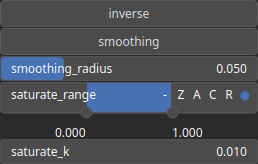

HeightmapToMask Node
====================

Convert an heightmap to a mask (remap values).

# Category

Converter
# Inputs

|Name|Type|Description|
| :--- | :--- | :--- |
|input|Heightmap|Heightmap.|

# Outputs

|Name|Type|Description|
| :--- | :--- | :--- |
|mask|Heightmap|Mask.|

# Parameters

|Name|Type|Description|
| :--- | :--- | :--- |
|inverse|Bool|Toggle inversion of the output values.|
|saturate_k|Float|Smoothing intensity of the amplitude saturation.|
|saturate_range|Value range|Saturation range: define the minimum and maximum values of the saturation process.|
|smoothing|Bool|Enable or disable smoothing to reduce noise in the curvature computation.|
|smoothing_radius|Float|Specifies the radius for smoothing, determining how much the curvature is averaged over neighboring pixels.|

# Example

No example available.