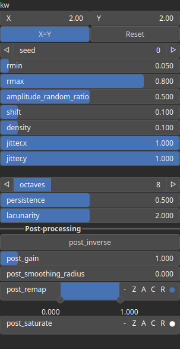

HemisphereFieldFbm Node
=======================

No description available

# Category

Primitive/Coherent
# Inputs

|Name|Type|Description|
| :--- | :--- | :--- |
|density|Heightmap|No description|
|dr|Heightmap|No description|
|dx|Heightmap|No description|
|dy|Heightmap|No description|
|envelope|Heightmap|No description|
|size|Heightmap|No description|

# Outputs

|Name|Type|Description|
| :--- | :--- | :--- |
|output|Heightmap|No description|

# Parameters

|Name|Type|Description|
| :--- | :--- | :--- |
|amplitude_random_ratio|Float|No description|
|density|Float|No description|
|jitter.x|Float|No description|
|jitter.y|Float|No description|
|kw|Wavenumber|No description|
|lacunarity|Float|No description|
|octaves|Integer|No description|
|persistence|Float|No description|
|post_gain|Float|No description|
|post_inverse|Bool|No description|
|post_remap|Value range|No description|
|post_saturate|Value range|No description|
|post_smoothing_radius|Float|No description|
|rmax|Float|No description|
|rmin|Float|No description|
|seed|Random seed number|No description|
|shift|Float|No description|

# Example

Corresponding Hesiod file: [HemisphereFieldFbm.hsd](../../examples/HemisphereFieldFbm.hsd). Use [Ctrl+I] in the node editor to import a hsd file within your current project. 

> **Note:** Example files are kept up-to-date with the latest version of [Hesiod](https://github.com/otto-link/Hesiod).
> If you find an error, please [open an issue](https://github.com/otto-link/Hesiod/issues).

