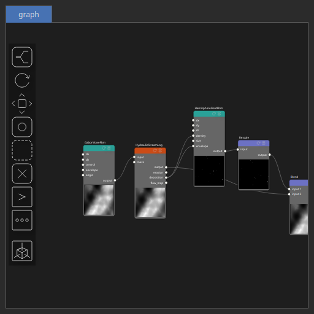

HemisphereFieldFbm Node
=======================

No description available

# Category

Primitive/Coherent
# Inputs

|Name|Type|Description|
| :--- | :--- | :--- |
|density|Heightmap|No description|
|dr|Heightmap|No description|
|dx|Heightmap|Displacement with respect to the domain size (x-direction).|
|dy|Heightmap|Displacement with respect to the domain size (y-direction).|
|envelope|Heightmap|Heightmap used as a post-process amplitude multiplier for the generated noise.|
|size|Heightmap|No description|

# Outputs

|Name|Type|Description|
| :--- | :--- | :--- |
|output|Heightmap|No description|

# Parameters

|Name|Type|Description|
| :--- | :--- | :--- |
|amplitude_random_ratio|Float|No description|
|density|Float|No description|
|jitter.x|Float|No description|
|jitter.y|Float|No description|
|Spatial Frequency|Wavenumber|Base spatial frequencies in the X and Y directions. The frequencies are defined with respect to the entire domain: for example, kw = 2 produces two full oscillations across the domain width (and similarly for the Y direction).|
|Lacunarity|Float|The frequency scaling factor for successive noise octaves. Higher values increase the frequency of each successive octave.|
|Octaves|Integer|The number of octaves for fractal noise generation. More octaves add finer details to the terrain.|
|Persistence|Float|The amplitude scaling factor for subsequent noise octaves. Lower values reduce the contribution of higher octaves.|
|Gain|Float|Set the gain. Gain is a power law transformation altering the distribution of signal values, compressing or expanding certain regions of the signal depending on the exponent of the power law.|
|Gamma|Float|No description|
|Invert Output|Bool|Inverts the output values after processing, flipping low and high values across the midrange.|
|Remap Range|Value range|Linearly remaps the output values to a specified target range (default is [0, 1]).|
|Saturation Range|Value range|Modifies the amplitude of elevations by first clamping them to a given interval and then scaling them so that the restricted interval matches the original input range. This enhances contrast in elevation variations while maintaining overall structure.|
|Smoothing Radius|Float|Defines the radius for post-processing smoothing, determining the size of the neighborhood used to average local values and reduce high-frequency detail. A radius of 0 disables smoothing.|
|rmax|Float|No description|
|rmin|Float|No description|
|Seed|Random seed number|Random seed number. The random seed is an offset to the randomized process. A different seed will produce a new result.|
|shift|Float|No description|

# Example

Corresponding Hesiod file: [HemisphereFieldFbm.hsd](../../examples/HemisphereFieldFbm.hsd). Use [Ctrl+I] in the node editor to import a hsd file within your current project. 

> **Note:** Example files are kept up-to-date with the latest version of [Hesiod](https://github.com/otto-link/Hesiod).
> If you find an error, please [open an issue](https://github.com/otto-link/Hesiod/issues).

