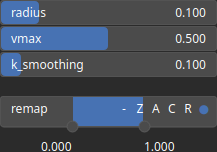

HydraulicBlur Node
==================

Hydraulic Blur applied a cell-based hydraulic erosion using a nonlinear diffusion model.

# Category

WIP
# Inputs

|Name|Type|Description|
| :--- | :--- | :--- |
|input|Heightmap|Input heightmap.|

# Outputs

|Name|Type|Description|
| :--- | :--- | :--- |
|output|Heightmap|Eroded heightmap.|

# Parameters

|Name|Type|Description|
| :--- | :--- | :--- |
|k_smoothing|Float|Smoothing factor, if any.|
|radius|Float|Gaussian filter radius (with respect to a unit domain).|
|remap|Value range|Remap the operator's output to a specified range, defaulting to [0, 1].|
|vmax|Float|Maximum elevation for the details.|

# Example

No example available.