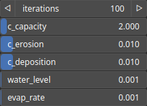

HydraulicMusgrave Node
======================

TODO

# Category

WIP
# Inputs

|Name|Type|Description|
| :--- | :--- | :--- |
|input|Heightmap|TODO|
|moisture|Heightmap|TODO|

# Outputs

|Name|Type|Description|
| :--- | :--- | :--- |
|output|Heightmap|TODO|

# Parameters

|Name|Type|Description|
| :--- | :--- | :--- |
|c_capacity|Float|TODO|
|c_deposition|Float|TODO|
|c_erosion|Float|TODO|
|evap_rate|Float|TODO|
|iterations|Integer|TODO|
|water_level|Float|TODO|

# Example

