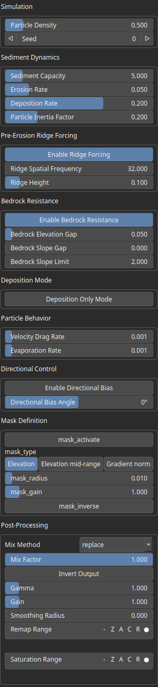

HydraulicParticle Node
======================

HydraulicParticle is a particle-based hydraulic erosion operator that simulates the erosion and sediment transport processes that occur due to the flow of water over a terrain represented by the input heightmap. This type of operator models erosion by tracking the movement of virtual particles (or sediment particles) as they are transported by water flow and interact with the terrain.

# Category

Erosion/Hydraulic
# Inputs

|Name|Type|Description|
| :--- | :--- | :--- |
|bedrock|VirtualArray|Bedrock elevation, erosion process cannot carve the heightmap further down this point.|
|input|VirtualArray|Input heightmap.|
|mask|VirtualArray|Mask defining the filtering intensity (expected in [0, 1]).|
|moisture|VirtualArray|Moisture map, influences the amount of water locally deposited.|

# Outputs

|Name|Type|Description|
| :--- | :--- | :--- |
|deposition|VirtualArray|Deposition map (in [0, 1]).|
|erosion|VirtualArray|Erosion map (in [0, 1]).|
|output|VirtualArray|Eroded heightmap.|

# Parameters

|Name|Type|Description|
| :--- | :--- | :--- |
|Directional Bias Angle|Float|No description|
|Bedrock Elevation Gap|Float|No description|
|Bedrock Slope Limit|Float|No description|
|Bedrock Slope Gap|Float|No description|
|Sediment Capacity|Float|Particle capacity.|
|Deposition Rate|Float|Particle deposition coefficient.|
|Erosion Rate|Float|Particle erosion cofficient.|
|Particle Inertia Factor|Float|TODO|
|Deposition Only Mode|Bool|TODO|
|Velocity Drag Rate|Float|Particle drag rate.|
|Enable Bedrock Resistance|Bool|No description|
|Enable Directional Bias|Bool|No description|
|Enable Ridge Forcing|Bool|No description|
|Evaporation Rate|Float|Particle water evaporation rate.|
|Particle Density|Float|TODO|
|Gain|Float|Mid-centered gain transformation applied to the elevation values. This is a non-linear recurve operator centered around the mid elevation (typically 0.5). Increasing the gain pushes values toward the minimum and maximum elevations, creating flatter low/high regions with a steeper transition around the midpoint.|
|Gamma|Float|Standard gamma correction applied to the elevation values. This is a monotonic power-law remapping that shifts emphasis toward low or high elevations, making the overall shape sharper or bulkier without changing its ordering.|
|Invert Output|Bool|Inverts the output values after processing, flipping low and high values across the midrange.|
|Mix Factor|Float|Mixing factor for blending input and output values. A value of 0 uses only the input, 1 uses only the output, and intermediate values perform a linear interpolation.|
|Mix Method|Enumeration|Method used to combine input and output values. Options include linear interpolation (default), min, max, smooth min, smooth max, add, and subtract.|
|Remap Range|Value range|Linearly remaps the output values to a specified target range (default is [0, 1]).|
|Saturation Range|Value range|Modifies the amplitude of elevations by first clamping them to a given interval and then scaling them so that the restricted interval matches the original input range. This enhances contrast in elevation variations while maintaining overall structure.|
|Smoothing Radius|Float|Defines the radius for post-processing smoothing, determining the size of the neighborhood used to average local values and reduce high-frequency detail. A radius of 0 disables smoothing.|
|Ridge Height|Float|No description|
|Ridge Spatial Frequency|Float|No description|
|Seed|Random seed number|Random seed number. The random seed is an offset to the randomized process. A different seed will produce a new result.|

# Example

No example available.