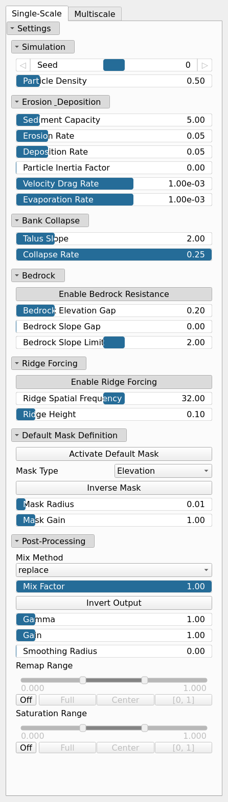

HydraulicParticle Node
======================

HydraulicParticle is a particle-based hydraulic erosion operator that simulates the erosion and sediment transport processes that occur due to the flow of water over a terrain represented by the input heightmap. This type of operator models erosion by tracking the movement of virtual particles (or sediment particles) as they are transported by water flow and interact with the terrain. Erosion is gradient-driven: flat or masked-to-zero input has no slope and produces little or no change. Erode full-domain relief first, then multiply by the land mask.

## Category

Erosion/Hydraulic
## Inputs

|Name|Type|Description|
| :--- | :--- | :--- |
|bedrock|VirtualArray|Bedrock elevation, erosion process cannot carve the heightmap further down this point.|
|input|VirtualArray|Input heightmap.|
|mask|VirtualArray|Mask defining the filtering intensity (expected in [0, 1]).|
|moisture|VirtualArray|Moisture map, influences the amount of water locally deposited.|

## Outputs

|Name|Type|Description|
| :--- | :--- | :--- |
|deposition|VirtualArray|Deposition map (in [0, 1]).|
|erosion|VirtualArray|Erosion map (in [0, 1]).|
|output|VirtualArray|Eroded heightmap.|

## Parameters

Parameters common to all groups (Single-Scale, Multiscale):
|Name|Type|Description|
| :--- | :--- | :--- |
|Seed|Random seed number|Random seed number. The random seed is an offset to the randomized process. A different seed will produce a new result.|
|Particle Density|Float|Number of erosion particles spawned relative to the heightmap resolution; higher densities erode more thoroughly at a higher computational cost.|
|Sediment Capacity|Float|Particle capacity.|
|Erosion Rate|Float|Particle erosion cofficient.|
|Deposition Rate|Float|Particle deposition coefficient.|
|Particle Inertia Factor|Float|Particle inertia factor: how strongly a particle keeps its current direction instead of following the local gradient. Higher values produce longer, straighter erosion paths.|
|Velocity Drag Rate|Float|Particle drag rate.|
|Evaporation Rate|Float|Particle water evaporation rate.|
|Talus Slope|Float|Maximum stable bank slope limit. When channel erosion carves bank slopes steeper than this threshold, adjacent terrain relaxes and collapses into the channel.|
|Collapse Rate|Float|Rate of bank collapse and talus relaxation. Controls how much steep bank material collapses into the channel when slopes exceed the talus limit.|
|Enable Bedrock Resistance|Bool|Generates an automatic bedrock heightmap when no bedrock input is connected, limiting maximum erosion depth based on elevation and slope.|
|Bedrock Elevation Gap|Float|Controls elevation-based bedrock offset. Increases allowable erosion depth proportionally to elevation relative to the terrain height range, enabling deeper erosion at higher altitudes while protecting lowlands.|
|Bedrock Slope Gap|Float|Controls slope-based bedrock offset. Deepens the bedrock on flatter surfaces below the slope limit, protecting steep cliff faces from over-erosion.|
|Bedrock Slope Limit|Float|Slope threshold for slope-based bedrock resistance. Areas steeper than this slope limit have less erosion allowance to preserve steep cliff formations.|
|Enable Ridge Forcing|Bool|Enables ridge forcing during multiscale erosion: an added large-scale ridge pattern that steers particles and accentuates ridge lines.|
|Ridge Spatial Frequency|Float|Spatial frequency of the ridge forcing pattern; higher values produce more, narrower ridges.|
|Ridge Height|Float|Amplitude of the ridge forcing relative to the terrain elevation range; controls how strongly ridges are accentuated.|
|Activate Default Mask|Bool|Enables or disables the internal mask. If the node's 'mask' input is connected, this setting is bypassed and the input mask is used instead.|
|Mask Type|Choice|Specifies how the internal mask is computed: 'Elevation' uses height, 'Gradient Norm' uses slope, and 'Elevation mid-range' selects the middle portion of the height range. This parameter is ignored when a 'mask' input is connected.|
|Inverse Mask|Bool|Inverts the internal mask, applying the operator where the mask is low. Ignored if a 'mask' input is provided.|
|Mask Radius|Float|Defines the smoothing radius for the internal mask. A value of 0 disables smoothing. This is bypassed if the 'mask' input is used.|
|Mask Gain|Float|Controls the intensity or influence of the internal mask. Bypassed if the 'mask' input is connected.|
|Mix Method|Enumeration|Method used to combine input and output values. Options include linear interpolation (default), min, max, smooth min, smooth max, add, and subtract.|
|Mix Factor|Float|Mixing factor for blending input and output values. A value of 0 uses only the input, 1 uses only the output, and intermediate values perform a linear interpolation.|
|Invert Output|Bool|Inverts the output values after processing, flipping low and high values across the midrange.|
|Gamma|Float|Standard gamma correction applied to the elevation values. This is a monotonic power-law remapping that shifts emphasis toward low or high elevations, making the overall shape sharper or bulkier without changing its ordering.|
|Gain|Float|Mid-centered gain transformation applied to the elevation values. This is a non-linear recurve operator centered around the mid elevation (typically 0.5). Increasing the gain pushes values toward the minimum and maximum elevations, creating flatter low/high regions with a steeper transition around the midpoint.|
|Smoothing Radius|Float|Defines the radius for post-processing smoothing, determining the size of the neighborhood used to average local values and reduce high-frequency detail. A radius of 0 disables smoothing.|
|Remap Range|Value range|Linearly remaps the output values to a specified target range (default is [0, 1]).|
|Saturation Range|Value range|Modifies the amplitude of elevations by first clamping them to a given interval and then scaling them so that the restricted interval matches the original input range. This enhances contrast in elevation variations while maintaining overall structure.|

### Multiscale

|Name|Type|Description|
| :--- | :--- | :--- |
|Levels|Integer|Number of cascade levels for multiscale erosion. Steps per level scale as powers of two from coarse to fine.|
|Mix|Float|Interpolation blend factor between original input heightmap (0) and eroded heightmap (1) at each multiscale upsampling step to preserve high-frequency details.|

## Example

Corresponding Hesiod file: [HydraulicParticle.hsd](../../examples/HydraulicParticle.hsd). Use [Ctrl+I] in the node editor to import a hsd file within your current project.

!!! note
    Example files are kept up-to-date with the latest version of [Hesiod](https://github.com/otto-link/Hesiod).
    If you find an error, please [open an issue](https://github.com/otto-link/Hesiod/issues).

