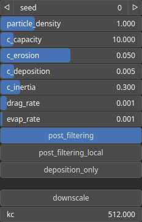

HydraulicParticle Node
======================

HydraulicParticle is a particle-based hydraulic erosion operator that simulates the erosion and sediment transport processes that occur due to the flow of water over a terrain represented by the input heightmap. This type of operator models erosion by tracking the movement of virtual particles (or sediment particles) as they are transported by water flow and interact with the terrain.

# Category

Erosion/Hydraulic
# Inputs

|Name|Type|Description|
| :--- | :--- | :--- |
|bedrock|Heightmap|Bedrock elevation, erosion process cannot carve the heightmap further down this point.|
|input|Heightmap|Input heightmap.|
|mask|Heightmap|Mask defining the filtering intensity (expected in [0, 1]).|
|moisture|Heightmap|Moisture map, influences the amount of water locally deposited.|

# Outputs

|Name|Type|Description|
| :--- | :--- | :--- |
|deposition|Heightmap|Deposition map (in [0, 1]).|
|erosion|Heightmap|Erosion map (in [0, 1]).|
|output|Heightmap|Eroded heightmap.|

# Parameters

|Name|Type|Description|
| :--- | :--- | :--- |
|c_capacity|Float|Particle capacity.|
|c_deposition|Float|Particle deposition coefficient.|
|c_erosion|Float|Particle erosion cofficient.|
|c_inertia|Float|TODO|
|deposition_only|Bool|TODO|
|downscale|Bool|TODO|
|drag_rate|Float|Particle drag rate.|
|evap_rate|Float|Particle water evaporation rate.|
|kc|Float|TODO|
|particle_density|Float|TODO|
|post_filtering|Bool|TODO|
|post_filtering_local|Bool|TODO|
|seed|Random seed number|Random seed number.|

# Example

