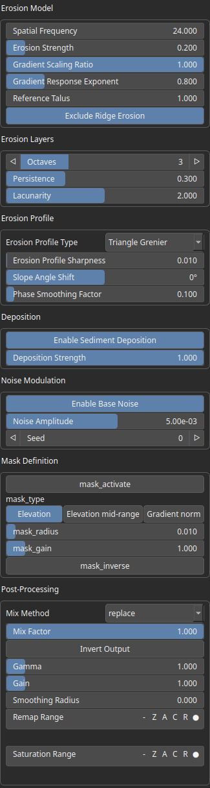

HydraulicProcedural Node
========================

TODO

# Category

Erosion/Hydraulic
# Inputs

|Name|Type|Description|
| :--- | :--- | :--- |
|angle_shift|VirtualArray|No description|
|input|VirtualArray|TODO|
|kp_multiplier|VirtualArray|No description|
|mask|VirtualArray|Mask defining the filtering intensity (expected in [0, 1]).|
|noise_x|VirtualArray|No description|
|noise_y|VirtualArray|No description|

# Outputs

|Name|Type|Description|
| :--- | :--- | :--- |
|output|VirtualArray|TODO|
|ridge_mask|VirtualArray|TODO|

# Parameters

|Name|Type|Description|
| :--- | :--- | :--- |
|Slope Angle Shift|Float|No description|
|Enable Sediment Deposition|Bool|No description|
|Erosion Strength|Float|No description|
|Deposition Strength|Float|No description|
|Enable Base Noise|Bool|No description|
|Erosion Profile Type|Enumeration|TODO|
|Erosion Profile Sharpness|Float|No description|
|Exclude Ridge Erosion|Bool|No description|
|Gradient Response Exponent|Float|No description|
|Gradient Scaling Ratio|Float|No description|
|Spatial Frequency|Float|No description|
|Lacunarity|Float|No description|
|mask_activate|Bool|No description|
|mask_gain|Float|No description|
|mask_inverse|Bool|No description|
|mask_radius|Float|No description|
|mask_type|Choice|No description|
|Noise Amplitude|Float|No description|
|Octaves|Integer|No description|
|Persistence|Float|No description|
|Phase Smoothing Factor|Float|TODO|
|Gain|Float|No description|
|Gamma|Float|No description|
|Invert Output|Bool|No description|
|Mix Factor|Float|No description|
|Mix Method|Enumeration|No description|
|Remap Range|Value range|No description|
|Saturation Range|Value range|No description|
|Smoothing Radius|Float|No description|
|Seed|Random seed number|Random seed number. The random seed is an offset to the randomized process. A different seed will produce a new result.|
|Reference Talus|Float|No description|

# Example

No example available.