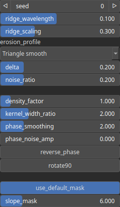

HydraulicProcedural Node
========================

TODO

# Category

WIP
# Inputs

|Name|Type|Description|
| :--- | :--- | :--- |
|input|Heightmap|TODO|
|mask|Heightmap|Mask defining the filtering intensity (expected in [0, 1]).|

# Outputs

|Name|Type|Description|
| :--- | :--- | :--- |
|output|Heightmap|TODO|
|ridge_mask|Heightmap|TODO|

# Parameters

|Name|Type|Description|
| :--- | :--- | :--- |
|delta|Float|TODO|
|density_factor|Float|TODO|
|erosion_profile|Enumeration|TODO|
|kernel_width_ratio|Float|TODO|
|noise_ratio|Float|TODO|
|phase_noise_amp|Float|TODO|
|phase_smoothing|Float|TODO|
|reverse_phase|Bool|TODO|
|ridge_scaling|Float|TODO|
|ridge_wavelength|Float|TODO|
|rotate90|Bool|TODO|
|seed|Random seed number|TODO|
|slope_mask|Float|TODO|
|use_default_mask|Bool|TODO|

# Example

