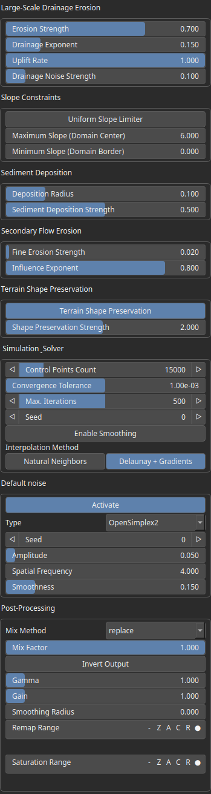

HydraulicSaleve Node
====================

Simulates hydraulic erosion using a stream power law on an adaptive triangulated mesh. The terrain is converted to a mesh, eroded through flow accumulation and slope-driven processes, then projected back to a heightmap. The main influencing parameters are 'Drainage Exponent' and 'Maximum Slope (Domain Center)', which drive most of the terrain shaping.

# Category

Erosion/Hydraulic
# Inputs

|Name|Type|Description|
| :--- | :--- | :--- |
|dx|VirtualArray|Displacement with respect to the domain size (x-direction).|
|dy|VirtualArray|Displacement with respect to the domain size (y-direction).|
|input|VirtualArray|No description|
|mask|VirtualArray|No description|

# Outputs

|Name|Type|Description|
| :--- | :--- | :--- |
|output|VirtualArray|No description|

# Parameters

|Name|Type|Description|
| :--- | :--- | :--- |
|Control Points Count|Integer|Number of vertices in the adaptive triangulated mesh. Higher => more details, slower computation.|
|Deposition Radius|Float|Spatial extent where sediment is redistributed. Larger => smoother, more diffused deposition.|
|Activate|Bool|Enables or disables the built-in drainage noise. If an external noise input is provided, it overrides this default noise.|
|Spatial Frequency|Float|Base spatial frequencies in the X and Y directions.|
|Amplitude|Float|Noise amplitude.|
|Type|Enumeration|Noise type.|
|Seed|Random seed number|Random seed number. The random seed is an offset to the randomized process. A different seed will produce a new result.|
|Smoothness|Float|Controls the resulting smoothness of the fractal layering process.|
|Drainage Noise Strength|Float|Adds spatial perturbation to flow directions. Breaks symmetry and produces more natural, irregular drainage patterns.|
|Enable Smoothing|Bool|No description|
|Sediment Deposition Strength|Float|Amount of material deposited during erosion. Higher => more filling of valleys and flatter basins.|
|Shape Preservation Strength|Float|No description|
|Interpolation Method|Choice|No description|
|Drainage Exponent|Float|Controls how strongly water flow (drainage area) influences erosion. Higher values => channels concentrate more => sharper river networks.|
|Max. Iterations|Integer|Hard cap on simulation steps.|
|Gain|Float|Mid-centered gain transformation applied to the elevation values. This is a non-linear recurve operator centered around the mid elevation (typically 0.5). Increasing the gain pushes values toward the minimum and maximum elevations, creating flatter low/high regions with a steeper transition around the midpoint.|
|Gamma|Float|Standard gamma correction applied to the elevation values. This is a monotonic power-law remapping that shifts emphasis toward low or high elevations, making the overall shape sharper or bulkier without changing its ordering.|
|Invert Output|Bool|Inverts the output values after processing, flipping low and high values across the midrange.|
|Mix Factor|Float|Mixing factor for blending input and output values. A value of 0 uses only the input, 1 uses only the output, and intermediate values perform a linear interpolation.|
|Mix Method|Enumeration|Method used to combine input and output values. Options include linear interpolation (default), min, max, smooth min, smooth max, add, and subtract.|
|Remap Range|Value range|Linearly remaps the output values to a specified target range (default is [0, 1]).|
|Saturation Range|Value range|Modifies the amplitude of elevations by first clamping them to a given interval and then scaling them so that the restricted interval matches the original input range. This enhances contrast in elevation variations while maintaining overall structure.|
|Smoothing Radius|Float|Defines the radius for post-processing smoothing, determining the size of the neighborhood used to average local values and reduce high-frequency detail. A radius of 0 disables smoothing.|
|Terrain Shape Preservation|Bool|Modulates erosion resistance based on height. Typically preserves peaks and reduces flattening.|
|Seed|Random seed number|Random seed number. The random seed is an offset to the randomized process. A different seed will produce a new result.|
|Maximum Slope (Domain Center)|Float|Upper bound on slope in central regions. Prevents unrealistic steep gradients.|
|Minimum Slope (Domain Border)|Float|Upper bound on slope constraint near boundaries. Helps stabilize edges and avoid artifacts.|
|Influence Exponent|Float|Shapes how flow intensity affects fine erosion. Higher => more concentrated erosion.|
|Fine Erosion Strength|Float|Controls small-scale channel carving (secondary erosion). Enhances details like rills and small streams.|
|Erosion Strength|Float|Blend factor between original terrain and eroded result. Low => subtle erosion, High => fully eroded terrain.|
|Convergence Tolerance|Float|Threshold for stopping iterations. Lower => more precise but slower convergence.|
|Uniform Slope Limiter|Bool|If enabled, uses a single slope limit everywhere. Otherwise, slope varies spatially (center vs borders).|
|Uplift Rate|Float|Constant terrain elevation increase per iteration. Competes with erosion => defines long-term mountain vs valley balance.|

# Example

No example available.