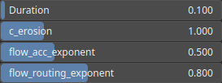

HydraulicSchott Node
====================

TODO

# Category

WIP
# Inputs

|Name|Type|Description|
| :--- | :--- | :--- |
|input|VirtualArray|TODO|

# Outputs

|Name|Type|Description|
| :--- | :--- | :--- |
|flow_map|VirtualArray|TODO|
|output|VirtualArray|TODO|

# Parameters

|Name|Type|Description|
| :--- | :--- | :--- |
|c_erosion|Float|TODO|
|Duration|Float|No description|
|flow_acc_exponent|Float|TODO|
|flow_routing_exponent|Float|TODO|

# Example

No example available.