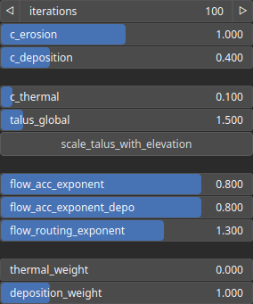

HydraulicSchott Node
====================

TODO

# Category

WIP
# Inputs

|Name|Type|Description|
| :--- | :--- | :--- |
|input|Heightmap|TODO|
|mask|Heightmap|Mask defining the filtering intensity (expected in [0, 1]).|

# Outputs

|Name|Type|Description|
| :--- | :--- | :--- |
|flow_map|Heightmap|TODO|
|output|Heightmap|TODO|

# Parameters

|Name|Type|Description|
| :--- | :--- | :--- |
|c_deposition|Float|TODO|
|c_erosion|Float|TODO|
|c_thermal|Float|TODO|
|deposition_weight|Float|TODO|
|flow_acc_exponent|Float|TODO|
|flow_acc_exponent_depo|Float|TODO|
|flow_routing_exponent|Float|TODO|
|iterations|Integer|TODO|
|scale_talus_with_elevation|Bool|TODO|
|talus_global|Float|TODO|
|thermal_weight|Float|TODO|

# Example

No example available.