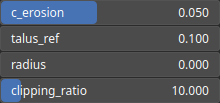

HydraulicStream Node
====================

HydraulicStream is an hydraulic erosion operator using the flow stream approach and an infinite flow direction algorithm for simulating the erosion processes. Simulate water flow across the terrain using the infinite flow direction algorithm. As water flows over the terrain, flow accumulation representing the volume of water that passes through each point on the map, is computed to evaluate the erosive power of the water flow.

# Category

WIP
# Inputs

|Name|Type|Description|
| :--- | :--- | :--- |
|input|Heightmap|Input heightmap.|
|mask|Heightmap|Mask defining the filtering intensity (expected in [0, 1]).|

# Outputs

|Name|Type|Description|
| :--- | :--- | :--- |
|erosion|Heightmap|Erosion map (in [0, 1]).|
|output|Heightmap|Eroded heightmap.|

# Parameters

|Name|Type|Description|
| :--- | :--- | :--- |
|c_erosion|Float|Erosion intensity.|
|clipping_ratio|Float|Flow accumulation clipping ratio.|
|radius|Float|Carving kernel radius.|
|talus_ref|Float|Reference talus, with small values of talus_ref leading to thinner flow streams.|

# Example

No example available.