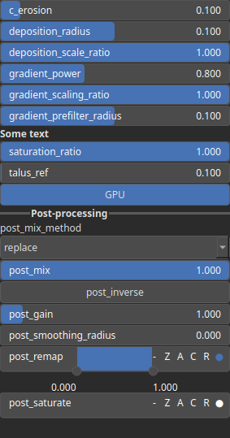

HydraulicStreamLog Node
=======================

HydraulicStream is a hydraulic erosion operator using a flow-stream formulation and an infinite flow-direction algorithm (D∞). Erosion intensity is driven by flow accumulation, terrain gradient, moisture, and optional bedrock limits. Deposition is simulated using convolution kernels whose radius and scale control smoothing and sediment redistribution.

# Category

Erosion/Hydraulic
# Inputs

|Name|Type|Description|
| :--- | :--- | :--- |
|input|Heightmap|Input elevation map to erode.|
|mask|Heightmap|Mask controlling the local intensity of erosion (expected in [0, 1]).|

# Outputs

|Name|Type|Description|
| :--- | :--- | :--- |
|deposition|Heightmap|Sediment deposition map, normalized in [0, 1].|
|erosion|Heightmap|Erosion intensity map, normalized in [0, 1].|
|flow_map|Heightmap|Flow accumulation map computed using the infinite flow direction algorithm.|
|output|Heightmap|Final terrain after erosion, deposition, and post-processing.|

# Parameters

|Name|Type|Description|
| :--- | :--- | :--- |
|Erosion Strength|Float|Erosion coefficient controlling the overall strength of erosion during flow simulation.|
|Deposition Radius|Float|Deposition kernel radius. Values > 0 apply smoothing to sediment deposition, simulating lateral diffusion.|
|Sediment Amount Scale|Float|Scaling factor controlling how much sediment is deposited after erosion.|
|Influence Power|Float|Exponent applied to the terrain gradient to modulate erosion intensity. Higher values increase sensitivity to steep slopes.|
|Prefilter Radius|Float|Radius of the smoothing filter applied to the gradient field prior to erosion. Helps stabilize erosion on noisy terrain.|
|Influence Scale|Float|Scaling factor applied to gradient-based erosion intensity, adjusting how strongly slope contributes to erosion.|
|Gain|Float|Power-law transformation applied after erosion/deposition. Adjusts contrast by compressing or expanding parts of the signal.|
|Invert Output|Bool|Invert the output values after processing. Low values become high and vice-versa.|
|Mix Factor|Float|Blend factor between the input terrain and the processed terrain. 0 = input only, 1 = processed only.|
|Mix Method|Enumeration|Method used to combine input and output: linear interpolation, min, max, smooth min, smooth max, add, subtract.|
|Remap Range|Value range|Linear remapping of the final output into a target range (default [0, 1]).|
|Saturation Range|Value range|Clamp elevation values to an interval and rescale them back to the full range to enhance contrast.|
|Smoothing Radius|Float|Radius of the final smoothing pass applied after all erosion operations. 0 disables smoothing.|
|Water Saturation Threshold|Float|Flow accumulation saturation threshold. Controls clipping of water flux to avoid runaway erosion.|
|Slope Threshold|Float|Reference talus angle. Lower values produce thinner flow streams by increasing directional concentration.|

# Example

No example available.