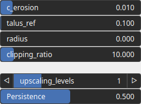

HydraulicStreamUpscaleAmplification Node
========================================

TODO

# Category

WIP
# Inputs

|Name|Type|Description|
| :--- | :--- | :--- |
|input|Heightmap|TODO|
|mask|Heightmap|Mask defining the filtering intensity (expected in [0, 1]).|

# Outputs

|Name|Type|Description|
| :--- | :--- | :--- |
|output|Heightmap|TODO|

# Parameters

|Name|Type|Description|
| :--- | :--- | :--- |
|c_erosion|Float|TODO|
|clipping_ratio|Float|TODO|
|persistence|Float|The amplitude scaling factor for subsequent noise octaves. Lower values reduce the contribution of higher octaves.|
|radius|Float|TODO|
|talus_ref|Float|Reference talus, with small values of talus_ref leading to thinner flow streams.|
|upscaling_levels|Integer|TODO|

# Example

No example available.