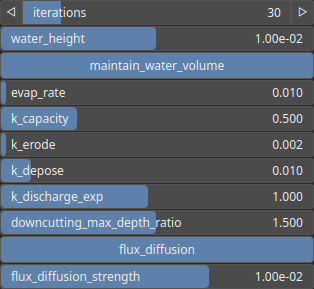

HydraulicVpipes Node
====================

HydraulicVpipes performs hydraulic erosion using a virtual pipe algorithm, which is a method that simulates erosion and sediment transport processes by mimicking the behavior of water flowing through a network of virtual pipes. This approach models erosion based on the principles of fluid dynamics and sediment transport, while also considering the local topography of the terrain represented by the input heightmap.

# Category

WIP
# Inputs

|Name|Type|Description|
| :--- | :--- | :--- |
|bedrock|VirtualArray|Bedrock elevation, erosion process cannot carve the heightmap further down this point.|
|input|VirtualArray|Input heightmap.|
|mask|VirtualArray|Mask defining the filtering intensity (expected in [0, 1]).|
|moisture|VirtualArray|Moisture map, influences the amount of water locally deposited.|

# Outputs

|Name|Type|Description|
| :--- | :--- | :--- |
|output|VirtualArray|Eroded heightmap.|
|sediment|VirtualArray|No description|
|water_depth|VirtualArray|Output water depth map representing flooded areas.|

# Parameters

|Name|Type|Description|
| :--- | :--- | :--- |
|downcutting_max_depth_ratio|Float|No description|
|evap_rate|Float|Particle water evaporation rate.|
|flux_diffusion|Bool|No description|
|flux_diffusion_strength|Float|No description|
|iterations|Integer|Number of simulation iterations.|
|k_capacity|Float|No description|
|k_depose|Float|No description|
|k_discharge_exp|Float|No description|
|k_erode|Float|No description|
|maintain_water_volume|Bool|No description|
|water_height|Float|Total water height..|

# Example

No example available.