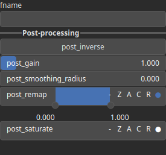

ImportHeightmap Node
====================

ImportHeightmap imports an heighmap from a grayscale PNG 8bit file.

# Category

IO/Files
# Outputs

|Name|Type|Description|
| :--- | :--- | :--- |
|output|Heightmap|Output heightmap.|

# Parameters

|Name|Type|Description|
| :--- | :--- | :--- |
|fname|Filename|Filename of the image file to import.|
|post_gain|Float|No description|
|post_inverse|Bool|No description|
|post_remap|Value range|No description|
|post_smoothing_radius|Float|No description|

# Example

