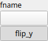

ImportTexture Node
==================

TODO

# Category

Export
# Outputs

|Name|Type|Description|
| :--- | :--- | :--- |
|texture|VirtualTexture|TODO|

# Parameters

|Name|Type|Description|
| :--- | :--- | :--- |
|flip_y|Bool|No description|
|fname|Filename|TODO|

# Example

No example available.  
