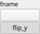

ImportTexture Node
==================

TODO

## Category

Export
## Outputs

|Name|Type|Description|
| :--- | :--- | :--- |
|texture|VirtualTexture|TODO|

## Parameters

|Name|Type|Description|
| :--- | :--- | :--- |
|flip_y|Bool|No description|
|fname|Filename|TODO|
|keep_aspect_ratio|Bool|No description|

## Example

Corresponding Hesiod file: [ImportTexture.hsd](../../examples/ImportTexture.hsd). Use [Ctrl+I] in the node editor to import a hsd file within your current project.

!!! note
    Example files are kept up-to-date with the latest version of [Hesiod](https://github.com/otto-link/Hesiod).
    If you find an error, please [open an issue](https://github.com/otto-link/Hesiod/issues).

