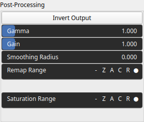

Inverse Node
============

Inverse flips the sign of every values.

# Category

Math/Base
# Inputs

|Name|Type|Description|
| :--- | :--- | :--- |
|input|Heightmap|Input heightmap.|

# Outputs

|Name|Type|Description|
| :--- | :--- | :--- |
|output|Heightmap|Binary heightmap.|

# Parameters

|Name|Type|Description|
| :--- | :--- | :--- |
|post_gain|Float|No description|
|post_inverse|Bool|No description|
|post_remap|Value range|No description|
|post_smoothing_radius|Float|No description|

# Example

No example available.