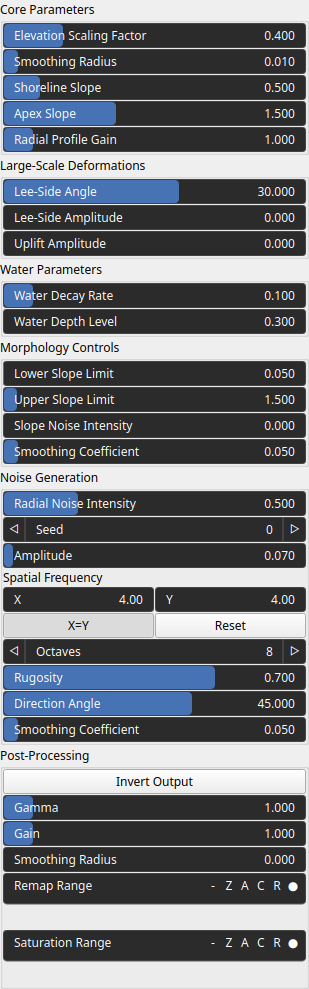
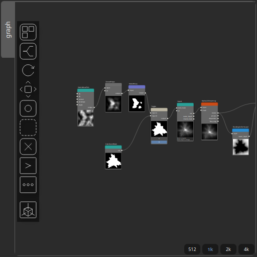
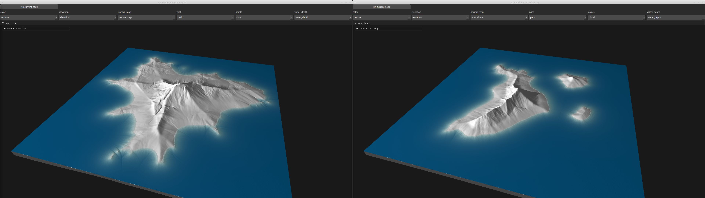

Island Node
===========

This function generates a procedural island heightmap from a binary land mask by combining a distance-based radial profile with fractal noise modulation.

# Category

Primitive/Geological
# Inputs

|Name|Type|Description|
| :--- | :--- | :--- |
|dr|Heightmap|Input radial noise. Optional, if not set, the embedded default noise generator is used.|
|land_mask|Heightmap|Binary mask defining the island’s footprint; nonzero pixels are considered land. Consider using the node IslandLandMask to generate this mask.|

# Outputs

|Name|Type|Description|
| :--- | :--- | :--- |
|inland_mask|Heightmap|Output buffer receiving a mask of inland pixels (non-coastal land).|
|out|Heightmap|No description|
|water_depth|Heightmap|Output water depth map representing flooded areas.|

# Parameters

|Name|Type|Description|
| :--- | :--- | :--- |
|Elevation Scaling Factor|Float|Global elevation scale.|
|Smoothing Radius|Float|Radius of the smoothing filter applied to the distance transform with respect to a unit domain.|
|Smoothing Coefficient|Float|Smoothing factor applied to the final radial profile for continuity.|
|Lee-Side Amplitude|Float|Strength of lee-side erosion.|
|Lee-Side Angle|Float|Direction (angle) used to compute lee-side erosion.|
|Amplitude|Float|Overall amplitude of the noise added to the terrain surface.|
|Direction Angle|Float|Rotation angle of the noise field, allowing oriented terrain features.|
|Smoothing Coefficient|Float|Smoothing factor.|
|Spatial Frequency|Wavenumber|Base spatial frequencies in the X and Y directions.|
|Octaves|Integer|Number of FBM layers used to build the noise (more octaves means more detail).|
|Rugosity|Float|Persistence-like factor controlling roughness decay between FBM octaves.|
|Gain|Float|Set the gain. Gain is a power law transformation altering the distribution of signal values, compressing or expanding certain regions of the signal depending on the exponent of the power law.|
|Gamma|Float|No description|
|Invert Output|Bool|Inverts the output values after processing, flipping low and high values across the midrange.|
|Remap Range|Value range|Linearly remaps the output values to a specified target range (default is [0, 1]).|
|Saturation Range|Value range|Modifies the amplitude of elevations by first clamping them to a given interval and then scaling them so that the restricted interval matches the original input range. This enhances contrast in elevation variations while maintaining overall structure.|
|Smoothing Radius|Float|Defines the radius for post-processing smoothing, determining the size of the neighborhood used to average local values and reduce high-frequency detail. A radius of 0 disables smoothing.|
|Radial Noise Intensity|Float|Strength of radial displacement noise applied to deform the island outline.|
|Radial Profile Gain|Float|Exponent controlling how quickly elevation falls off from center to shore.|
|Seed|Random seed number|Random seed number. The random seed is an offset to the randomized process. A different seed will produce a new result.|
|Apex Slope|Float|Slope at the summit.|
|Upper Slope Limit|Float|Maximum slope value allowed in the radial profile.|
|Lower Slope Limit|Float|Minimum slope value used in shaping the radial profile.|
|Slope Noise Intensity|Float|Amount of noise applied to locally vary the slope and break uniform gradients.|
|Shoreline Slope|Float|Slope at the shoreline.|
|Uplift Amplitude|Float|Amplitude of uplift deformation.|
|Water Decay Rate|Float|Water depth decay with the distance to the shoreline.|
|Water Depth Level|Float|Maximum deth of water.|

# Example

Corresponding Hesiod file: [Island.hsd](../../examples/Island.hsd). Use [Ctrl+I] in the node editor to import a hsd file within your current project. 

> **Note:** Example files are kept up-to-date with the latest version of [Hesiod](https://github.com/otto-link/Hesiod).
> If you find an error, please [open an issue](https://github.com/otto-link/Hesiod/issues).

  
# Screenshots

