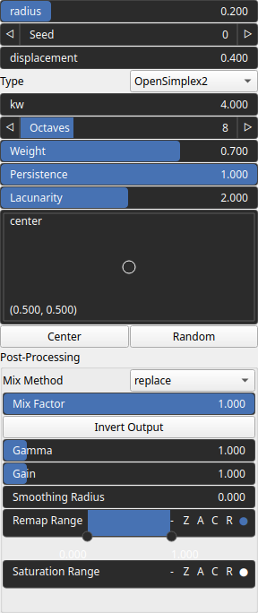
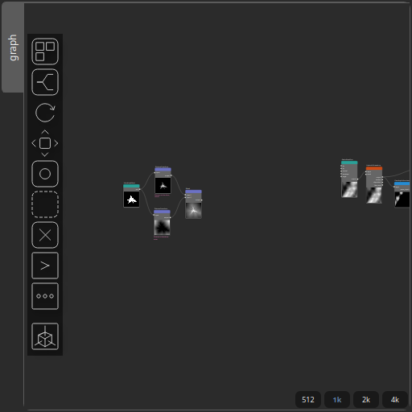

IslandLandMask Node
===================

No description available

# Category

Primtive/Geological
# Outputs

|Name|Type|Description|
| :--- | :--- | :--- |
|out|Heightmap|No description|

# Parameters

|Name|Type|Description|
| :--- | :--- | :--- |
|center|Vec2Float|No description|
|displacement|Float|No description|
|kw|Float|No description|
|lacunarity|Float|No description|
|noise_type|Enumeration|No description|
|octaves|Integer|No description|
|persistence|Float|No description|
|Gain|Float|No description|
|Invert Output|Bool|No description|
|Remap Range|Value range|No description|
|Saturation Range|Value range|No description|
|Smoothing Radius|Float|No description|
|radius|Float|No description|
|seed|Random seed number|No description|
|weight|Float|No description|

# Example

Corresponding Hesiod file: [IslandLandMask.hsd](../../examples/IslandLandMask.hsd). Use [Ctrl+I] in the node editor to import a hsd file within your current project. 

> **Note:** Example files are kept up-to-date with the latest version of [Hesiod](https://github.com/otto-link/Hesiod).
> If you find an error, please [open an issue](https://github.com/otto-link/Hesiod/issues).

