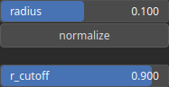

KernelDiskSmooth Node
=====================

No description available

# Category

Primitive/Kernel
# Outputs

|Name|Type|Description|
| :--- | :--- | :--- |
|kernel|Array|No description|

# Parameters

|Name|Type|Description|
| :--- | :--- | :--- |
|normalize|Bool|No description|
|r_cutoff|Float|No description|
|radius|Float|No description|

# Example

No example available.