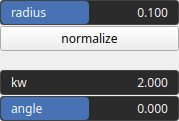

KernelGabor Node
================

KernelGabor generates a Gabor kernel.

## Category

Primitive/Kernel
## Outputs

|Name|Type|Description|
| :--- | :--- | :--- |
|kernel|Array|Output kernel.|

## Parameters

|Name|Type|Description|
| :--- | :--- | :--- |
|angle|Float|Kernel angle. Expressed in degrees.|
|kw|Float|Base spatial frequencies in the X and Y directions. The frequencies are defined with respect to the entire domain: for example, kw = 2 produces two full oscillations across the domain width (and similarly for the Y direction).|
|normalize|Bool|Normalize kernel so that the sum of the elements equals 1, preserving the overall intensity of an heightmap after convolution for instance.|
|radius|Float|Kernel radius with respect to the domain size.|

## Example

Corresponding Hesiod file: [KernelGabor.hsd](../../examples/KernelGabor.hsd). Use [Ctrl+I] in the node editor to import a hsd file within your current project.

!!! note
    Example files are kept up-to-date with the latest version of [Hesiod](https://github.com/otto-link/Hesiod).
    If you find an error, please [open an issue](https://github.com/otto-link/Hesiod/issues).

