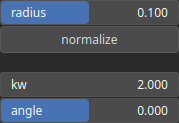

KernelGabor Node
================

KernelGabor generates a Gabor kernel.

# Category

Primitive/Kernel
# Outputs

|Name|Type|Description|
| :--- | :--- | :--- |
|kernel|Array|Output kernel.|

# Parameters

|Name|Type|Description|
| :--- | :--- | :--- |
|angle|Float|Kernel angle.|
|kw|Float|Kernel wavenumber (spatial frequency).|
|normalize|Bool|Normalize kernel so that the sum of the elements equals 1, preserving the overall intensity of an heightmap after convolution for instance.|
|radius|Float|Kernel radius with respect to the domain size.|

# Example

