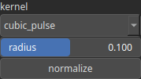

KernelPrim Node
===============

KernelPrim generates a 'kernel', refering to a small matrix used to apply specific effects based on convolution for instance.

# Category

Primitive/Kernel
# Outputs

|Name|Type|Description|
| :--- | :--- | :--- |
|kernel|Array|Output kernel.|

# Parameters

|Name|Type|Description|
| :--- | :--- | :--- |
|kernel|Enumeration|Kernel type. Available values: biweight, cone, cone_smooth, cubic_pulse, disk, lorentzian, smooth_cosine, square, tricube.|
|normalize|Bool|Normalize kernel so that the sum of the elements equals 1, preserving the overall intensity of an heightmap after convolution for instance.|
|radius|Float|Kernel radius with respect to the domain size.|

# Example

No example available.