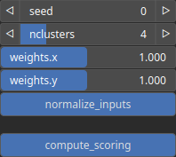

KmeansClustering2 Node
======================

KmeansClustering2 node groups the data into clusters based on the values of the two input features.

# Category

Features/Clustering
# Inputs

|Name|Type|Description|
| :--- | :--- | :--- |
|feature 1|Heightmap|First measurable property or characteristic of the data points being analyzed (e.g elevation, gradient norm, etc...|
|feature 2|Heightmap|Second measurable property or characteristic of the data points being analyzed (e.g elevation, gradient norm, etc...|

# Outputs

|Name|Type|Description|
| :--- | :--- | :--- |
|output|Heightmap|Cluster labelling.|
|scoring|vector<Heightmap>|Score in [0, 1] of the cell to belong to a given cluster|

# Parameters

|Name|Type|Description|
| :--- | :--- | :--- |
|compute_scoring|Bool|Determine whether scoring is computed.|
|nclusters|Integer|Number of clusters.|
|normalize_inputs|Bool|Determine whether the feature amplitudes are normalized before the clustering.|
|seed|Random seed number|Random seed number.|
|weights.x|Float|Weight of the first feature.|
|weights.y|Float|Weight of the second feature.|

# Example

