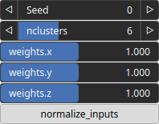

KmeansClustering3 Node
======================

KmeansClustering2 node groups the data into clusters based on the values of the three input features.

## Category

Terrain Features/Clustering
## Inputs

|Name|Type|Description|
| :--- | :--- | :--- |
|feature 1|VirtualArray|First measurable property or characteristic of the data points being analyzed (e.g elevation, gradient norm, etc...|
|feature 2|VirtualArray|First measurable property or characteristic of the data points being analyzed (e.g elevation, gradient norm, etc...|
|feature 3|VirtualArray|Third measurable property or characteristic of the data points being analyzed (e.g elevation, gradient norm, etc...|

## Outputs

|Name|Type|Description|
| :--- | :--- | :--- |
|output|VirtualArray|Cluster labelling.|

## Parameters

|Name|Type|Description|
| :--- | :--- | :--- |
|nclusters|Integer|Number of clusters.|
|normalize_inputs|Bool|Determine whether the feature amplitudes are normalized before the clustering.|
|Seed|Random seed number|Random seed number. The random seed is an offset to the randomized process. A different seed will produce a new result.|
|weights.x|Float|Weight of the first feature.|
|weights.y|Float|Weight of the third feature.|
|weights.z|Float|TODO|

## Example

Corresponding Hesiod file: [KmeansClustering3.hsd](../../examples/KmeansClustering3.hsd). Use [Ctrl+I] in the node editor to import a hsd file within your current project.

!!! note
    Example files are kept up-to-date with the latest version of [Hesiod](https://github.com/otto-link/Hesiod).
    If you find an error, please [open an issue](https://github.com/otto-link/Hesiod/issues).

