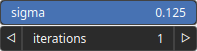

Laplace Node
============

Laplace smoothing filter reduces noise and smooth out variations in pixel intensity while preserving the overall structure of an image.

## Category

Filter/Smoothing
## Inputs

|Name|Type|Description|
| :--- | :--- | :--- |
|input|VirtualArray|Input heightmap.|
|mask|VirtualArray|Mask defining the filtering intensity (expected in [0, 1]).|

## Outputs

|Name|Type|Description|
| :--- | :--- | :--- |
|output|VirtualArray|Filtered heightmap.|

## Parameters

|Name|Type|Description|
| :--- | :--- | :--- |
|iterations|Integer|Number of successive filtering iterations.|
|sigma|Float|Filtering strength.|

## Example

Corresponding Hesiod file: [Laplace.hsd](../../examples/Laplace.hsd). Use [Ctrl+I] in the node editor to import a hsd file within your current project.

!!! note
    Example files are kept up-to-date with the latest version of [Hesiod](https://github.com/otto-link/Hesiod).
    If you find an error, please [open an issue](https://github.com/otto-link/Hesiod/issues).

