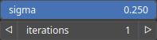

Laplace Node
============

Laplace smoothing filter reduces noise and smooth out variations in pixel intensity while preserving the overall structure of an image.

# Category

Filter/Smoothing
# Inputs

|Name|Type|Description|
| :--- | :--- | :--- |
|input|Heightmap|Input heightmap.|
|mask|Heightmap|Mask defining the filtering intensity (expected in [0, 1]).|

# Outputs

|Name|Type|Description|
| :--- | :--- | :--- |
|output|Heightmap|Filtered heightmap.|

# Parameters

|Name|Type|Description|
| :--- | :--- | :--- |
|iterations|Integer|Number of successive filtering iterations.|
|sigma|Float|Filtering strength.|

# Example

No example available.