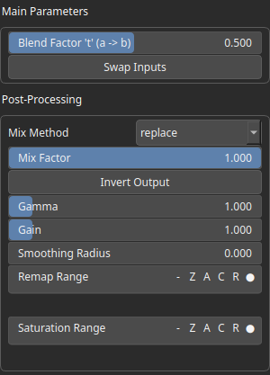

Lerp Node
=========

The Lerp operator, short for linear interpolation, is a method for smoothly transitioning between two values over a specified range or interval.

# Category

Math/Base
# Inputs

|Name|Type|Description|
| :--- | :--- | :--- |
|a|Heightmap|Start heightmap (t = 0).|
|b|Heightmap|End heightmap (t = 1).|
|t|Heightmap|Lerp factor, expected in [0, 1].|

# Outputs

|Name|Type|Description|
| :--- | :--- | :--- |
|output|Heightmap|Interpolated heightmap.|

# Parameters

|Name|Type|Description|
| :--- | :--- | :--- |
|t|Float|Lerp factor (in [0, 1]). Used only if the node input 't' is not set.|

# Example

