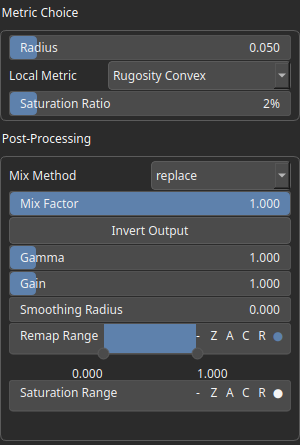

LocalMetrics Node
=================

Computes local geometric metrics on a heightmap to characterize terrain features such as roughness, convexity, or other neighborhood-based properties. The result highlights spatial variations based on a selected metric and a given sampling radius, and can be further refined using percentile-based saturation and post-processing controls.

# Category

Features
# Inputs

|Name|Type|Description|
| :--- | :--- | :--- |
|input|VirtualArray|Input heightmap on which the local metric is computed.|

# Outputs

|Name|Type|Description|
| :--- | :--- | :--- |
|mask|VirtualArray|Output heightmap containing the computed local metric values after optional saturation and post-processing.|

# Parameters

|Name|Type|Description|
| :--- | :--- | :--- |
|Local Metric|Enumeration|Selects the type of local metric to compute. Each metric analyzes the neighborhood of a point (within the given radius) to extract features such as roughness (rugosity), convexity, or other shape descriptors.|
|Gain|Float|Mid-centered gain transformation applied to the elevation values. This is a non-linear recurve operator centered around the mid elevation (typically 0.5). Increasing the gain pushes values toward the minimum and maximum elevations, creating flatter low/high regions with a steeper transition around the midpoint.|
|Gamma|Float|Standard gamma correction applied to the elevation values. This is a monotonic power-law remapping that shifts emphasis toward low or high elevations, making the overall shape sharper or bulkier without changing its ordering.|
|Invert Output|Bool|Inverts the output values after processing, flipping low and high values across the midrange.|
|Mix Factor|Float|Mixing factor for blending input and output values. A value of 0 uses only the input, 1 uses only the output, and intermediate values perform a linear interpolation.|
|Mix Method|Enumeration|Method used to combine input and output values. Options include linear interpolation (default), min, max, smooth min, smooth max, add, and subtract.|
|Remap Range|Value range|Linearly remaps the output values to a specified target range (default is [0, 1]).|
|Saturation Range|Value range|Modifies the amplitude of elevations by first clamping them to a given interval and then scaling them so that the restricted interval matches the original input range. This enhances contrast in elevation variations while maintaining overall structure.|
|Smoothing Radius|Float|Defines the radius for post-processing smoothing, determining the size of the neighborhood used to average local values and reduce high-frequency detail. A radius of 0 disables smoothing.|
|Radius|Float|Defines the spatial radius used to compute the local metric. It controls the size of the neighborhood around each point, with larger values producing smoother, more global features and smaller values capturing fine details.|
|Saturation Ratio|Float|Upper percentile used for adaptive saturation of the output values. Values above this percentile are progressively compressed to reduce the influence of extreme outliers, improving contrast in the majority of the data while preserving overall structure.|

# Example

No example available.