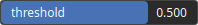

MakeBinary Node
===============

No description available

# Category

Operator/Morphology
# Inputs

|Name|Type|Description|
| :--- | :--- | :--- |
|input|VirtualArray|No description|

# Outputs

|Name|Type|Description|
| :--- | :--- | :--- |
|output|VirtualArray|No description|

# Parameters

|Name|Type|Description|
| :--- | :--- | :--- |
|threshold|Float|No description|

# Example

No example available.