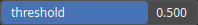

MakeBinary Node
===============

MakeBinary is a thresholding operator. It transforms an input heightmap into a binary heightmap, where each pixel is assigned either a value of 0 or 1, depending on whether its intensity value surpasses a specified threshold.

# Category

Operator/Morphology
# Inputs

|Name|Type|Description|
| :--- | :--- | :--- |
|input|Heightmap|Input heightmap.|

# Outputs

|Name|Type|Description|
| :--- | :--- | :--- |
|output|Heightmap|Binary heightmap.|

# Parameters

|Name|Type|Description|
| :--- | :--- | :--- |
|threshold|Float|Threshold value.|

# Example

No example available.