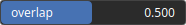

MakePeriodicStitching Node
==========================

Makes the input heightmap tileable by creating a smooth transition at the boundaries using stitching. This is useful for generating seamless textures or terrains that can be repeated without visible seams.

## Category

Operator/Tiling
## Inputs

|Name|Type|Description|
| :--- | :--- | :--- |
|input|VirtualArray|The input heightmap to be made tileable.|

## Outputs

|Name|Type|Description|
| :--- | :--- | :--- |
|output|VirtualArray|The output heightmap with smooth transitions at the boundaries, making it tileable.|

## Parameters

|Name|Type|Description|
| :--- | :--- | :--- |
|overlap|Float|The ratio of overlap at the boundaries. A higher value creates a smoother transition but may reduce the usable area of the heightmap.|

## Example

Corresponding Hesiod file: [MakePeriodicStitching.hsd](../../examples/MakePeriodicStitching.hsd). Use [Ctrl+I] in the node editor to import a hsd file within your current project.

!!! note
    Example files are kept up-to-date with the latest version of [Hesiod](https://github.com/otto-link/Hesiod).
    If you find an error, please [open an issue](https://github.com/otto-link/Hesiod/issues).

