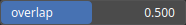

MakePeriodicStitching Node
==========================

Makes the input heightmap tileable by creating a smooth transition at the boundaries using stitching. This is useful for generating seamless textures or terrains that can be repeated without visible seams.

# Category

Operator/Tiling
# Inputs

|Name|Type|Description|
| :--- | :--- | :--- |
|input|Heightmap|The input heightmap to be made tileable.|

# Outputs

|Name|Type|Description|
| :--- | :--- | :--- |
|output|Heightmap|The output heightmap with smooth transitions at the boundaries, making it tileable.|

# Parameters

|Name|Type|Description|
| :--- | :--- | :--- |
|overlap|Float|The ratio of overlap at the boundaries. A higher value creates a smoother transition but may reduce the usable area of the heightmap.|

# Example

No example available.