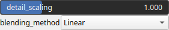

MixNormalMap Node
=================

TODO

# Category

Texture
# Inputs

|Name|Type|Description|
| :--- | :--- | :--- |
|normal map base|VirtualTexture|TODO|
|normal map detail|VirtualTexture|TODO|

# Outputs

|Name|Type|Description|
| :--- | :--- | :--- |
|normal map|VirtualTexture|TODO|

# Parameters

|Name|Type|Description|
| :--- | :--- | :--- |
|blending_method|Enumeration|TODO|
|detail_scaling|Float|TODO|

# Example

No example available.  
